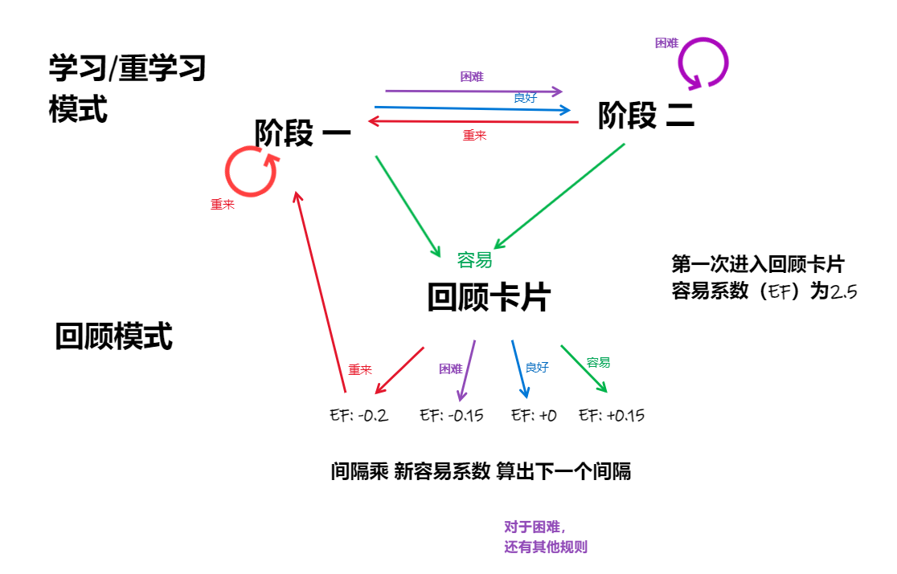

----
11-08-2015 12:00:00 #school #life
What is my attitude towards this new semester? How can I balance social affairs and study?

----
14-10-2018 12:00:00 #ent #life #todo
After 3 days of game abstinence, I know the video game is not necessary. However I still need some ways to relax.

- [ ] have a regular life.

----
04-10-2020 10:20:00 #finance #record
I sold my macbook. 
If those things didn't happen, how would I be right now?

----
18-04-2021 16:00:00 #work
1. Practice and simulation are crucial because they can uncover the blind spot in theory.
2. My boss's mindset is to start from simplicity and progress towards complexity. 
3. Recent work is about research of electromagnetic dynamics.

----
17-02-2023 20:25:44 #dev #spaced-repetition
review property for spaced-repetition: [rv: n_EF_dateStr_Inm1_lastReviewDate]

It uses the SM-2 algorithm, and the principle of spaced-repetition is shown in the following image:

reference:
- https://faqs.ankiweb.net/what-spaced-repetition-algorithm.html
- http://www.supermemo.com/english/ol/sm2.htm

----
29-03-2023 20:22:20 #dev #knowledge
The chronicleNote records ideas and thoughts quickly. 

----
31-05-2023 11:53:49 #quote #publish

> Happy is he who has the pure truth in him. He will regret no sacrifice that keeps it. 
> *-Goethe, 'Faust'*

----
09-07-2023 11:23:28 #quote

> Entirely taken up by the present, I could remember nothing; I had no distinct notion of myself as a person, nor had I the least idea of what had just happened to me. I did not know who I was, nor where I was; I felt neither pain, fear, nor anxiety. I watched my blood flowing as I might have watched a stream, without even thinking that the blood had anything to do with me. I felt throughout my whole being such a wonderful calm, that whenever I recall this feeling I can find nothing to compare with it in all the pleasures that stir our lives.
>
> *-Rousseau, Reveries of the Solitary Walker*

----
01-10-2023 10:19:00 #warning #dev
The default end of line character is LF, not CRLF(default in windows).

----
14-10-2023 16:14:32 #dev #idea
the entries in note should be Publish or Perish.

